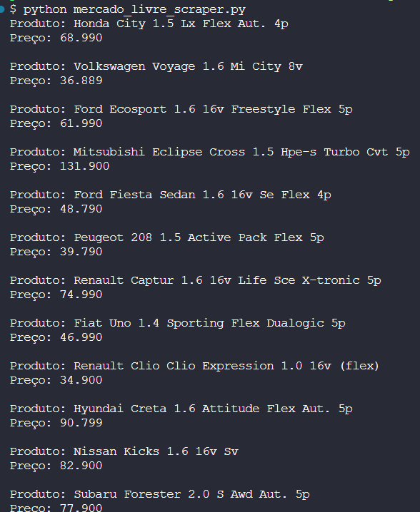

# Mercado Livre Scraper

Este é um projeto simples em Python para realizar scraping de dados de produtos na página de veículos financiáveis do Mercado Livre.

## Objetivo

O objetivo deste projeto é demonstrar como extrair informações básicas de produtos listados no Mercado Livre utilizando técnicas de web scraping. O script desenvolvido acessa a página de veículos financiáveis e extrai o nome e o preço dos produtos listados.

## Tecnologias Utilizadas

- Python 3
- Bibliotecas:
  - requests
  - BeautifulSoup (bs4)
  - Scrapy

## Instalação

1. **Clonar o repositório:**

  ```bash
  git clone https://github.com/jessikasousa/mercado-livre-scraper.git
  cd mercado-livre-scraper
  ```

2. Instalar as dependências:
  ```bash
  pip install -r requirements.txt
  ```

## Como Usar
### Executar o script:

Para executar o script e extrair os dados dos produtos do Mercado Livre, basta rodar o seguinte comando:
  ```bash
python mercado_livre_scraper.py
   ```
*Isso vai imprimir no terminal o nome e o preço dos produtos listados na página.*


## Estrutura do Projeto
- mercado_livre_scraper.py: Script principal que realiza o scraping da página.
- requirements.txt: Arquivo contendo as dependências necessárias para o projeto.
